# Muse AI

<div align="center">

**基于 LangChain4j 和 LangGraph4j 的 AI 代码生成平台**

通过自然语言对话生成完整的 Web 应用代码

</div>

---

## 目录

- [核心特性](#核心特性)
- [项目截图](#项目截图)
- [技术栈](#技术栈)
- [代码生成架构](#代码生成架构)
  - [LangChain4j 实现](#langchain4j-实现)
  - [LangGraph4j 实现](#langgraph4j-实现)
- [微服务架构](#微服务架构)
- [前端实现](#前端实现)
- [快速开始](#快速开始)
- [项目结构](#项目结构)
- [API 文档](#api-文档)
- [许可证](#许可证)

---

## 核心特性

- **AI 智能代码生成** - 支持三种生成模式：单文件 HTML、多文件项目、Vue3 完整应用
- **智能路由** - 基于阿里云 Qwen 模型自动选择最合适的代码生成模式
- **实时预览** - 生成的代码可实时预览，支持可视化编辑
- **流式响应** - 基于 SSE 的流式输出，实时展示 AI 生成过程
- **工具调用系统** - Vue 模式支持 AI 通过工具直接写入文件
- **图片资源收集** - 自动收集和管理项目所需的图片资源
- **代码质量检查** - AI 自动检查生成代码的质量
- **分布式会话** - 基于 Redis 的分布式会话管理和聊天记忆
- **自动截图** - 基于 Selenium 的网页自动截图服务

---

## 项目截图

### 完整应用界面

<div align="center">
  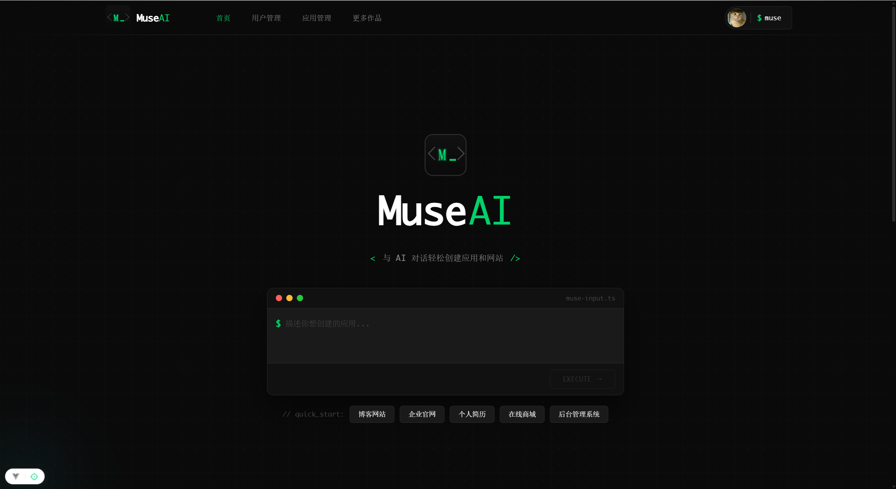
  <p><em>应用首页 - 用户登录后的主界面</em></p>
</div>

<br>

### 首页精选应用

<div align="center">
  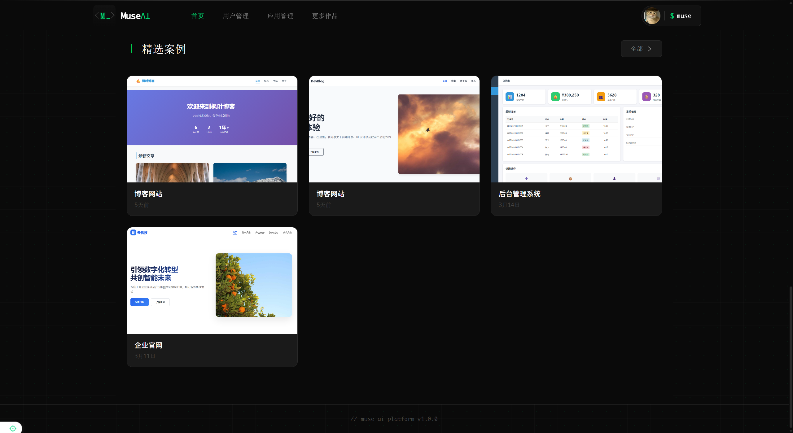
  <p><em>应用首页 - 首页中展示精选应用</em></p>
</div>

<br>

### 我的应用展示

<div align="center">
  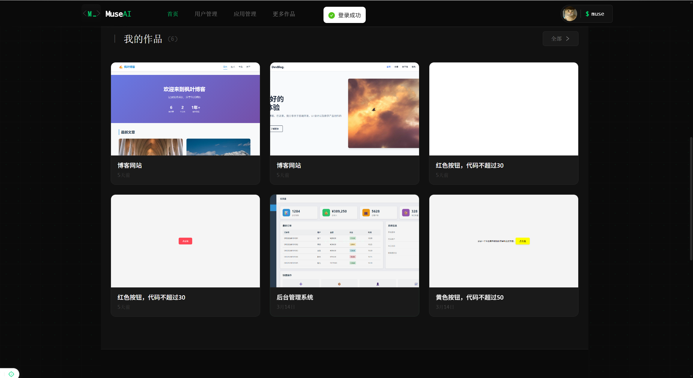
  <p><em>应用首页 - 首页中展示我的应用</em></p>
</div>

<br>

### AI 代码生成界面 + 代码实时预览

<div align="center">
  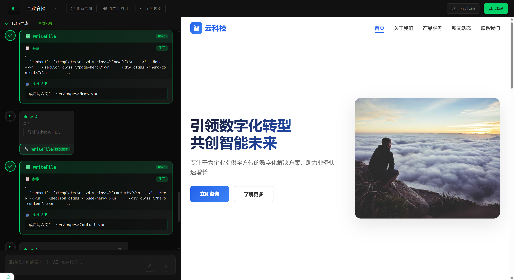
  <p><em>AI 对话界面 - 自然语言输入，实时生成代码</em></p>
</div>

<br>

### 可视化编辑

<div align="center">
  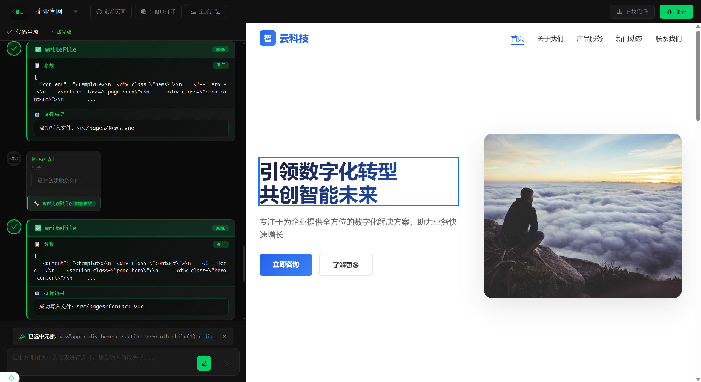
  <p><em>可视化编辑 - 点击元素进行编辑和样式修改</em></p>
</div>

<br>


### 用户管理

<div align="center">
  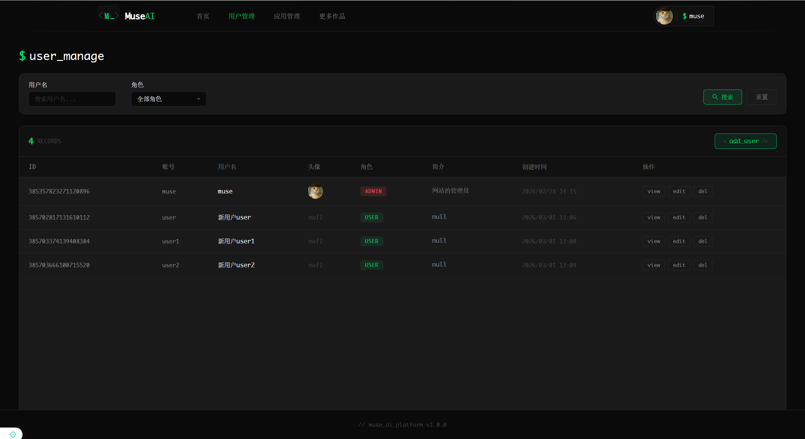
  <p><em>用户管理 - 网站用户预览与编辑</em></p>
</div>

<br>


### 应用管理

<div align="center">
  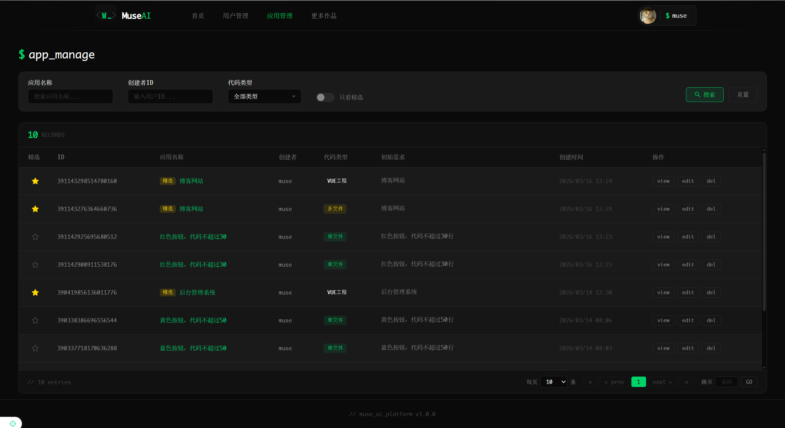
  <p><em>应用管理 - 生成应用列表</em></p>
</div>

<br>
---

## 技术栈

### 后端
- **Spring Boot** 3.5.11 - 应用框架
- **Java** 21 - 编程语言
- **MyBatis-Flex** 1.11.6 - ORM 框架
- **MySQL** - 关系型数据库
- **Redis** - 缓存和会话存储
- **MinIO** - 对象存储

### AI 集成
- **LangChain4j** 1.11.0 - AI 应用开发框架
- **LangGraph4j** 1.6.0-rc2 - AI 工作流编排框架
- **MiniMax API** - 主要代码生成模型（MiniMax-M2.5）
- **智谱 GLM** - 辅助代码生成模型（GLM-4.7-FlashX）
- **阿里云 Qwen** - 智能路由和图片生成

### 微服务
- **Spring Cloud Gateway** - API 网关
- **Dubbo** - RPC 通信框架
- **Nacos** - 服务注册与发现

### 前端
- **Vue 3** - 前端框架
- **TypeScript** - 类型安全

### 工具
- **Knife4j** 4.4.0 - API 文档
- **Selenium** 4.33.0 - 网页自动化
- **Hutool** 5.8.40 - 工具类库

---

## 代码生成架构

本项目提供了两种代码生成实现方式：**LangChain4j** 和 **LangGraph4j**。

### LangChain4j 实现

LangChain4j 实现采用线性流程架构，适合简单的代码生成场景。

#### 架构图

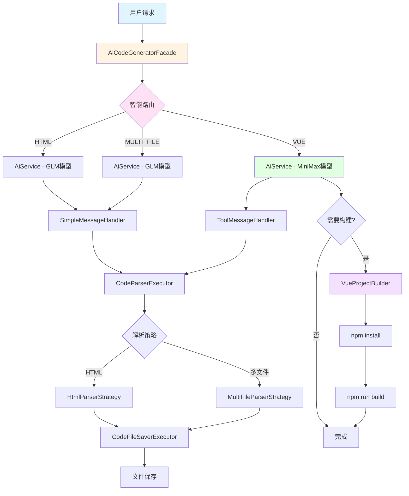

#### 核心组件

| 组件 | 路径 | 作用 |
|------|------|------|
| `AiService` | `ai/AiService.java` | 定义代码生成接口，使用 `@SystemMessage` 注解加载 prompt 模板 |
| `AiServiceFactory` | `ai/AiServiceFactory.java` | 创建和缓存 AiService 实例，使用 Caffeine 缓存（1小时过期） |
| `MiniMaxConfig` | `config/MiniMaxConfig.java` | 配置 MiniMax 模型（Vue 模式使用） |
| `GlmConfig` | `config/GlmConfig.java` | 配置 GLM 模型（HTML/MULTI_FILE 模式使用） |
| `SmartRouteService` | `ai/SmartRouteService.java` | 使用阿里云 Qwen 模型决定代码生成模式 |
| `AiCodeGeneratorFacade` | `core/AiCodeGeneratorFacade.java` | 代码生成门面，统一入口 |

#### 生成流程

1. **请求接收** → `AiCodeGeneratorFacade.generateCodeAndSaveStreaming()`
2. **智能路由** → `SmartRouteService` 决定使用哪种生成模式
3. **创建 AiService** → `AiServiceFactory` 根据模式创建配置好的服务实例
4. **AI 调用** → 调用相应的 AI 模型（MiniMax 或 GLM）
5. **流处理** → `MessageHandlerExecutor` 根据模式选择处理器
   - HTML/MULTI_FILE：`SimpleMessageHandler`
   - VUE：`ToolMessageHandler`（支持工具调用）
6. **解析保存** → `CodeParserExecutor` 解析 AI 输出 → `CodeFileSaverExecutor` 保存文件
7. **Vue 构建** → `VueProjectBuilder` 异步执行 `npm install` 和 `npm run build`

#### 工具系统

Vue 模式下，AI 可以通过工具系统直接操作文件系统：

| 工具 | 作用 |
|------|------|
| `FileWriteTool` | 写入文件 |
| `FileReadTool` | 读取文件 |
| `FileModifyTool` | 修改文件 |
| `FileDeleteTool` | 删除文件 |
| `FileDirReadTool` | 读取目录 |

#### 流式处理

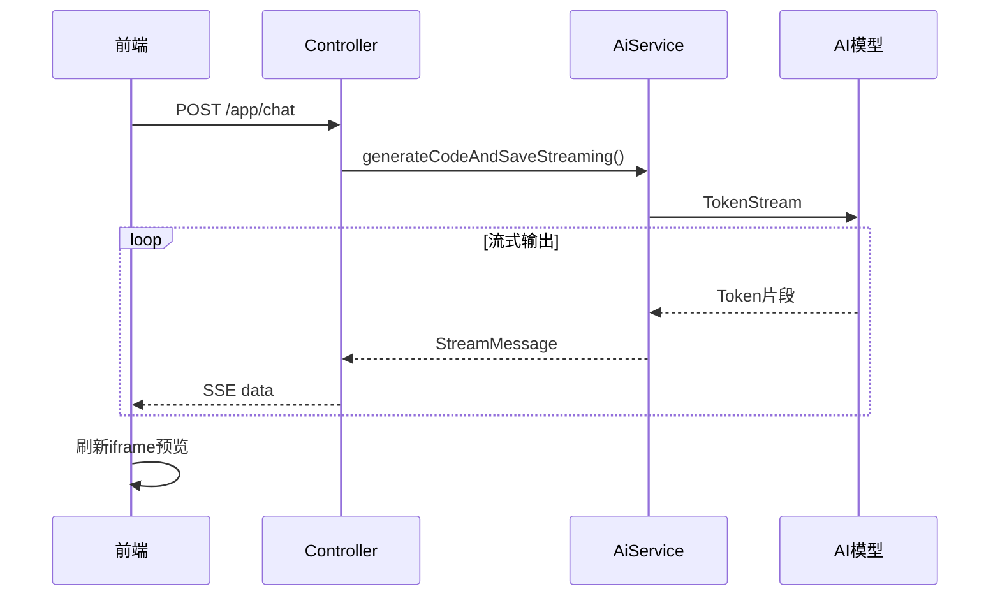

---

### LangGraph4j 实现

LangGraph4j 实现采用图状态机架构，支持复杂的流程编排、条件分支和并行执行。

#### 架构图

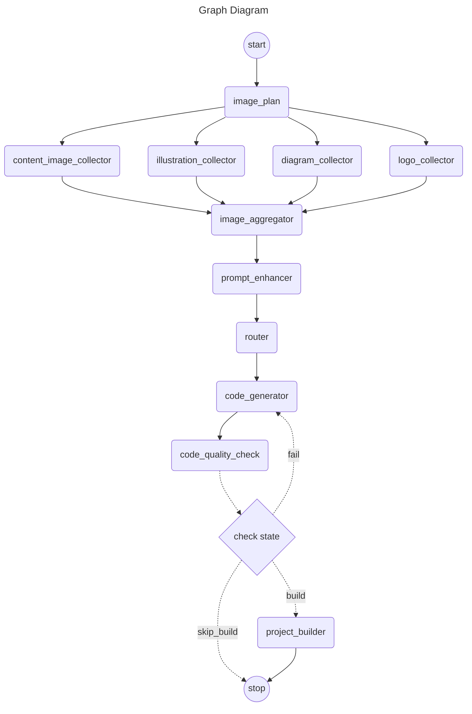

#### 核心组件

| 组件 | 路径 | 作用 |
|------|------|------|
| `CodeGenWorkflow` | `graph/CodeGenWorkflow.java` | 串行代码生成工作流 |
| `CodeGenConcurrentWorkflow` | `graph/CodeGenConcurrentWorkflow.java` | 并行代码生成工作流 |
| `WorkflowContext` | `graph/state/WorkflowContext.java` | 工作流状态上下文 |
| `ImagePlanNode` | `graph/node/ImagePlanNode.java` | 图片规划节点 |
| `PromptEnhancerNode` | `graph/node/PromptEnhancerNode.java` | 提示词增强节点 |
| `RouterNode` | `graph/node/RouterNode.java` | 智能路由节点 |
| `CodeGeneratorNode` | `graph/node/CodeGeneratorNode.java` | 代码生成节点 |
| `CodeQualityCheckNode` | `graph/node/CodeQualityCheckNode.java` | 代码质检节点 |

#### 节点说明

| 节点类型 | 作用 | 依赖服务 |
|----------|------|----------|
| 图片收集节点 | 收集项目所需的图片资源 | MiniMax API |
| 提示词增强节点 | 优化用户输入的提示词 | MiniMax API |
| 路由节点 | 决定使用哪种代码生成模式 | 阿里云 Qwen |
| 代码生成节点 | 生成实际代码 | LangChain4j AiService |
| 质检节点 | 检查生成代码质量 | MiniMax API |

#### LangChain4j vs LangGraph4j

| 特性 | LangChain4j | LangGraph4j |
|------|-------------|-------------|
| **架构模式** | 线性流程 | 图状态机 |
| **状态管理** | 无中间状态 | 完整的 WorkflowContext |
| **流程控制** | 顺序执行 | 条件分支、循环、并发 |
| **错误处理** | 直接返回 | 支持重试和回退 |
| **扩展性** | 需修改代码 | 添加节点和边即可扩展 |
| **适用场景** | 简单生成 | 复杂工作流编排 |

---

## 微服务架构

项目实现了从单体应用到微服务的完整架构，采用 Spring Cloud Alibaba + Dubbo 技术栈。

### 微服务列表

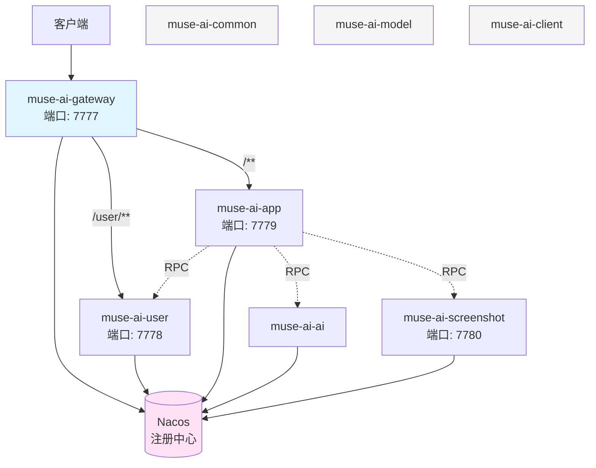

### 服务职责

| 服务 | 端口 | 职责 |
|------|------|------|
| **muse-ai-gateway** | 7777 | API 网关，统一入口，路由转发 |
| **muse-ai-user** | 7778 | 用户注册、登录、管理，会话管理 |
| **muse-ai-app** | 7779 | 应用管理，AI 代码生成核心逻辑 |
| **muse-ai-screenshot** | 7780 | 网页截图服务 |
| **muse-ai-ai** | - | AI 服务抽象层 |
| **muse-ai-common** | - | 公共组件（异常处理、响应格式、认证注解） |
| **muse-ai-model** | - | 数据传输对象（DTO/VO） |
| **muse-ai-client** | - | 内部服务接口定义 |

### 通信方式

1. **外部通信**：通过 Spring Cloud Gateway 统一入口，使用 HTTP 协议
2. **内部通信**：使用 Dubbo RPC 框架，基于 Triple 协议
3. **服务发现**：使用 Nacos 作为注册中心

### 配置要点

```yaml
# Nacos 服务注册
spring:
  cloud:
    nacos:
      discovery:
        server-addr: 106.54.215.151:8848
        namespace: 47f6fb31-1206-4a12-9dfb-e595de064aed

# Dubbo 配置
dubbo:
  registry:
    address: nacos://106.54.215.151:8848
  protocol:
    name: tri
    port: 50051-50053
```

---

## 前端实现

前端部分基于 Vue 3，重点实现了流式响应处理和 iframe 可视化编辑。

### iframe 沙箱安全配置

```vue
<iframe
  :src="iframeUrl"
  sandbox="allow-scripts allow-same-origin allow-forms allow-popups"
  @load="handleIframeLoad"
></iframe>
```

- `allow-scripts` - 允许执行脚本
- `allow-same-origin` - 允许同源访问
- `allow-forms` - 允许表单提交
- `allow-popups` - 允许弹出窗口

### 脚本注入机制

通过 `postMessage` 实现 iframe 与父页面之间的通信，注入可视化编辑脚本：

```typescript
// 注入编辑器脚本
iframe.contentWindow.postMessage({
  type: 'MUSE_INJECT_SCRIPT',
  script: EDITOR_INJECT_SCRIPT
}, '*')

// 消息类型
type IframeMessage =
  | { type: 'MUSE_ELEMENT_HOVER'; element: SelectedElement }
  | { type: 'MUSE_ELEMENT_SELECT'; element: SelectedElement }
  | { type: 'MUSE_ELEMENT_DESELECT' }
  | { type: 'MUSE_EDITOR_MODE'; enabled: boolean }
```

### SSE 流式通信

```typescript
const response = await fetch('/api/app/chat', {
  method: 'POST',
  body: JSON.stringify({ appId, userMessage })
})

const reader = response.body?.getReader()
const decoder = new TextDecoder()

while (true) {
  const { done, value } = await reader.read()
  if (done) break

  const chunk = decoder.decode(value, { stream: true })
  // 处理 SSE 格式数据
  const lines = chunk.split('\n')
  for (const line of lines) {
    if (line.startsWith('data:')) {
      const parsed = JSON.parse(line.slice(5))
      handleStreamMessage(parsed)
    }
  }
}
```

### 消息类型

| 类型 | 说明 |
|------|------|
| `TEXT` | AI 文本响应，流式输出 |
| `TOOL_REQUEST` | 工具调用请求（Vue 模式） |
| `TOOL_EXECUTED` | 工具执行结果 |
| `FINISH` | 生成完成，触发 iframe 刷新 |

---

## 快速开始

### 环境要求

- Java 21
- Maven 3.9+
- MySQL 8.0+
- Redis 6.0+
- Node.js 18+ (用于 Vue 项目构建)

### 环境变量

```bash
# Windows
set MYSQL_PASSWORD=your_mysql_password
set REDIS_PASSWORD=your_redis_password
set MUSE_MINIMAX_API_KEY=your_minimax_api_key
set MINIO_SECRET_KEY=your_minio_secret_key
set ALIYUN_AI_KEY=your_aliyun_ai_key
set GLM_KEY=your_glm_api_key
```

### 数据库初始化

```sql
source sql/create.sql
```

### 启动应用

```bash
# 克隆项目
git clone https://github.com/your-username/muse-ai.git
cd muse-ai

# 启动单体应用
mvn spring-boot:run

# 或启动微服务（依次启动）
cd muse-ai-microservice
# 先启动 Nacos
# 然后依次启动各微服务...
```

### 访问应用

- 应用地址：http://localhost:7777/api
- API 文档：http://localhost:7777/api/doc.html
- Swagger UI：http://localhost:7777/api/swagger-ui.html

---

## 项目结构

### 单体应用

```
muse-ai/
├── src/main/java/cn/edu/sxu/museai/
│   ├── ai/                  # AI 服务层（LangChain4j）
│   │   ├── model/           # AI DTO
│   │   └── tools/           # 工具实现
│   ├── graph/               # LangGraph4j 工作流
│   │   ├── node/            # 工作流节点
│   │   └── state/           # 状态管理
│   ├── controller/          # REST 控制器
│   ├── service/             # 业务逻辑层
│   ├── mapper/              # MyBatis-Flex 数据访问
│   ├── model/
│   │   ├── entity/          # 数据库实体
│   │   ├── dto/             # 请求对象
│   │   └── vo/              # 响应对象
│   ├── core/                # 代码生成核心
│   │   ├── handler/         # 流式消息处理
│   │   ├── parser/          # AI 响应解析
│   │   ├── saver/           # 文件保存
│   │   └── builder/         # 项目构建
│   ├── config/              # Spring 配置
│   ├── aop/                 # @AuthCheck 切面
│   └── exception/           # 全局异常处理
├── src/main/resources/
│   ├── prompt/              # AI 提示词模板
│   └── application.yaml     # 配置文件
└── pom.xml
```

### 微服务

```
muse-ai-microservice/
├── muse-ai-gateway/         # API 网关
├── muse-ai-user/            # 用户服务
├── muse-ai-app/             # 应用服务
├── muse-ai-ai/              # AI 服务
├── muse-ai-screenshot/      # 截图服务
├── muse-ai-common/          # 公共组件
├── muse-ai-model/           # 数据模型
├── muse-ai-client/          # 服务接口
└── pom.xml
```

---

## API 文档

项目使用 Knife4j 自动生成 API 文档，访问地址：

- **Knife4j 文档**：http://localhost:7777/api/doc.html
- **OpenAPI JSON**：http://localhost:7777/api/v3/api-docs

主要 API 端点：

| 端点 | 方法 | 说明 |
|------|------|------|
| `/api/user/register` | POST | 用户注册 |
| `/api/user/login` | POST | 用户登录 |
| `/api/app/create` | POST | 创建应用 |
| `/api/app/chat` | POST | AI 对话（流式） |
| `/api/app/list` | GET | 应用列表 |
| `/api/screenshot` | POST | 网页截图 |

---

## 许可证

本项目采用 [MIT License](LICENSE) 开源许可证。

```
MIT License

Copyright (c) 2025 Muse AI

Permission is hereby granted, free of charge, to any person obtaining a copy
of this software and associated documentation files (the "Software"), to deal
in the Software without restriction...
```

---

<div align="center">

**[⬆ 返回顶部](#muse-ai)**

</div>
